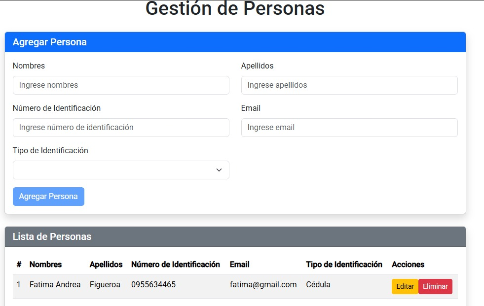
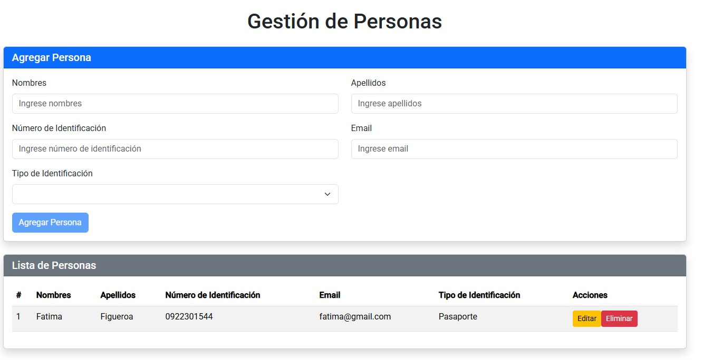
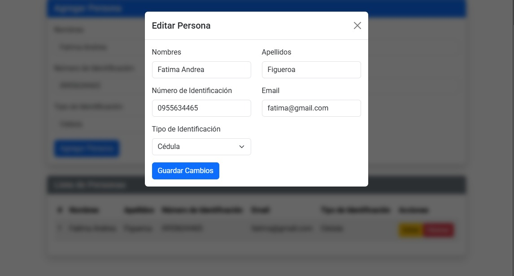

# Proyecto CRUD con .NET 8, Angular y Autenticación JWT

## Descripción
Este proyecto consta de dos partes principales:
- **Backend en .NET 8** utilizando **Entity Framework Core** para operaciones CRUD y **autenticación JWT**.
- **Frontend en Angular** con una interfaz de usuario para interactuar con las APIs.

El sistema está diseñado con autenticación segura, manejo de logs con **Serilog**, y documentación de las APIs a través de **Swagger**. Además, se configura la comunicación entre frontend y backend utilizando **CORS**

## Estructura del Proyecto

- **API-SECURE**: Carpeta que contiene el proyecto **Backend en .NET 8**.
- **app-security**: Carpeta que contiene el proyecto **Frontend en Angular**.
- **BaseDedatos**: Carpeta que contiene el script de sql server
- **validatorLIB**: Carpeta que contiene una libreria de clases para validar email

## Características

1. **Backend (.NET 8)**:
   - API RESTful para operaciones CRUD.
   - **Autenticación JWT** para asegurar las rutas de la API.
   - **Entity Framework Core** para gestionar la base de datos con **SQL Server**.
   - Uso de **Stored Procedures** para operacione de consulta en la base de datos.
   - Configuración de **Serilog** para el registro de logs.
   - **CORS** habilitado para la comunicación con el frontend de Angular.
   - Documentación de las APIs a través de **Swagger**.
   -Registro de logs utilizando Serilog

2. **Frontend (Angular)**:
   - Interfaz de usuario para interactuar con la API.
   - **Autenticación JWT** para mantener la sesión de usuario.
   - Uso de **CORS** para permitir la comunicación con el backend.

3. **Docker**:
   - Configuración de los contenedores para **Backend** y **Frontend**.

4. **ELK Stack (Elasticsearch, Logstash, Kibana)**:
   - Registro de logs utilizando **Serilog** y visualización a través de **Kibana**.

# Inicio

# Lista

# Actualizar Persona

# Inicio Sesion

# Registrarse

